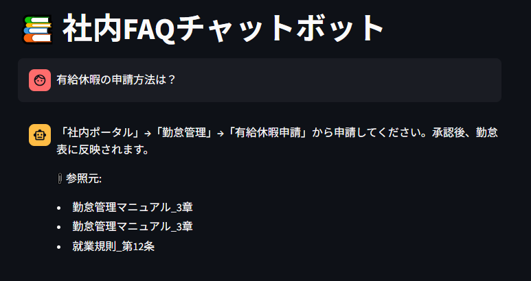
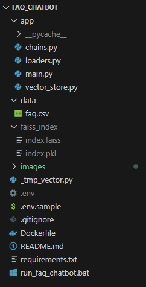

# 📚 社内FAQチャットボット（LangChain × OpenAI API × FAISS × Streamlit）

このプロジェクトは、社内のよくある質問（FAQ）を自然言語で問い合わせできるチャットボットを構築したものです。  
実務でも活用可能な構成で、生成AI技術の応用例としてポートフォリオに最適です。

---

## 🚀 このチャットボットでできること

- ✅ **FAQのCSVを読み込んでベクトル検索可能に**
- ✅ **自然言語で問い合わせ → GPTが回答生成**
- ✅ **Streamlit UIで即利用できるチャット画面**
- ✅ **再学習不要。CSV変更 → 自動再ベクトル化対応**

---

## 💻 UIデモ（画面イメージ）

### 🔸 起動後の初期画面


> 起動すると即使えるシンプルなチャット画面が表示されます。Streamlitベースで、社内PCでも軽量に動作します。

---

### 🔸 実際の質問＆回答例


> 「有給休暇の申請方法は？」といった自然文でも正確に回答できます。関連マニュアルへのリンクも自動で出力されます。

---

### 🔸 起動成功時（コマンドライン）


> `streamlit run app/main.py` 実行で簡単に起動。http://localhost:8501 にアクセスすればすぐに動作確認できます。

---

### 🔸 フォルダ構成（再現しやすさ重視）


> `app/`, `data/`, `faiss_index/` など、役割ごとに整理された構造でメンテナンス性にも配慮しています。

---

## 🛠 使用技術スタック

| 技術         | 用途                     |
|--------------|--------------------------|
| Python 3.10+ | 開発言語                 |
| LangChain    | LLM応答チェーン構築     |
| OpenAI API   | GPTによる自然言語応答   |
| FAISS        | ベクトル検索エンジン     |
| Streamlit    | チャットUIの構築        |

---

## 📁 ディレクトリ構成（主要ファイル）

```
faq_chatbot/
├ app/
│  ├ main.py             ← Streamlit UI
│  ├ chains.py           ← 応答チェーン定義
│  └ vector_store.py     ← FAISSベクトル作成
├ data/
│  └ faq.csv             ← FAQデータ（CSV）
├ faiss_index/           ← ベクトルデータ（自動生成）
├ run_faq_chatbot.bat    ← 起動スクリプト（Windows用）
├ .env.sample            ← APIキー設定テンプレ
└ README.md              ← このファイル
```

---

## ⚙️ セットアップ手順（ローカル実行）

1. 依存パッケージをインストール：

```bash
pip install -r requirements.txt
```

2. `.env.sample` を `.env` にコピーし、OpenAI APIキーを設定：

```env
OPENAI_API_KEY=sk-xxxxxxxxxxxxxxxxxxxxxx
```

3. 起動スクリプト（Windows専用）を実行：

```bash
run_faq_chatbot.bat
```

---

## 🔁 FAQを更新したい場合

- `data/faq.csv` を編集
- `run_faq_chatbot.bat` を再実行  
→ 自動でベクトルストアを再構築し、チャット画面に反映されます。

---

## 🔐 セキュリティ注意点

- `.env` に記載した**APIキーは公開リポジトリに絶対含めないこと**
- 代わりに `.env.sample` を同梱してください（ダミーキーを記載）

---

## 👨‍💻 制作担当

田中 大輝（フリーランスエンジニア）  
クラウドワークス案件対応／生成AIアプリ開発ポートフォリオ（2025）

---
